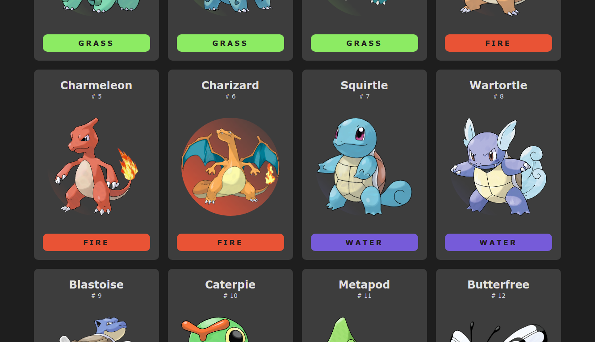

<h1 align="center">
    Pokedex
</h1>

<!-- 

  <a href="#-tecnologias">Tecnologias</a>&nbsp;&nbsp;&nbsp;|&nbsp;&nbsp;&nbsp;
  <a href="#-projeto">Projeto</a>&nbsp;&nbsp;&nbsp;|&nbsp;&nbsp;&nbsp;
  <a href="#memo-licença">Licença</a>

-->

 

## 🚀 Tecnologias

Esse projeto foi desenvolvido com as seguintes tecnologias:

- HTML
- CSS
- Javascript

## 💻 Projeto

O Pokedex é uma aplicação que consome um API e lista todos os Pokemons!

API utilizada: [http://pokeapi.co/](http://pokeapi.co/)

  

<!--
## :memo: Licença

Esse projeto está sob a licença MIT. Veja o arquivo [LICENSE](LICENSE.md) para mais detalhes. -->

---

Feito por Gabriel Silva com ensinamentos do Emerson Broga!
